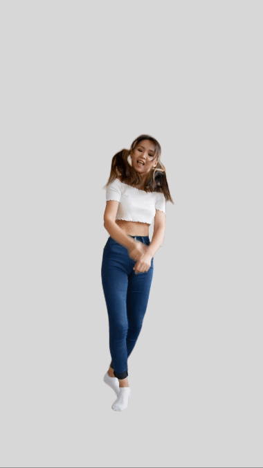

# Background Remover

Welcome to the Background Remover project! This tool allows you to effortlessly replace backgrounds in images and videos, making it perfect for creating professional LinkedIn profile pictures and more.

## Demo

### Images

Original Image | Generated Image
:-------------:|:---------------:
 | 

### Video

| Uploaded Video | Generated Video |
| -------------- | --------------- |
 | 
|                |                 |
 | 

## Installation

### Docker

1. Make sure you have Docker installed on your machine.
2. Clone the repository: `git clone https://github.com/pranay-009/background-remover.git`
3. Navigate to the project directory: `cd background-remover`
4. Build the Docker image: `docker build -t background-remover .`
5. Run the Docker container: `docker run -p 8501:8501 background-remover`

The application will be accessible at `http://localhost:8501`.

### Requirements.txt

1. Clone the repository: `git clone https://github.com/pranay-009/background-remover.git`
2. Navigate to the project directory: `cd background-remover`
3. Install dependencies using pip: `pip install -r requirements.txt`
4. Run the application: `streamlit run app.py`

The application will be accessible at `http://localhost:8501`.

## Usage

1. Upload an image or video file.
2. Select the desired background replacement.
3. Click on the "Generate" button.
4. Download the newly generated image or video.

Feel free to experiment and have fun with creating customized images and videos!

## License

This project is licensed under the [MIT License](LICENSE). Feel free to use, modify, and distribute it as needed.
